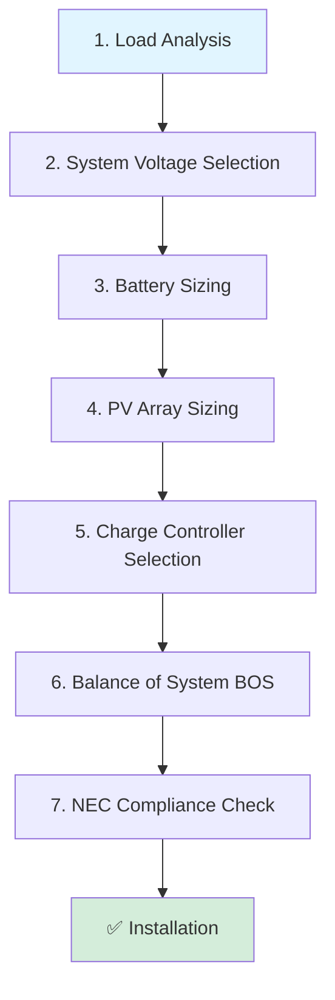

# 🛠️ Practical Design Procedures

[← Back to Main](../README.md)

---

## 📑 Table of Contents

- [Introduction](#-introduction)
- [Design Methodology Overview](#-design-methodology-overview)
- [Step-by-Step: Off-Grid System Design](#-step-by-step-off-grid-system-design)
- [Grid-Tied System Design](#-grid-tied-system-design)
- [Installation Best Practices](#-installation-best-practices)
- [Case Studies](#-case-studies)
- [Common Mistakes to Avoid](#-common-mistakes-to-avoid)

---

## 🎯 Introduction

This section provides **practical, step-by-step procedures** for designing PV systems. We'll cover:
- ✅ Complete off-grid design workflow
- ✅ Grid-tied system considerations
- ✅ Installation guidelines (mounting, angles, wiring)
- ✅ Real-world case studies
- ✅ Common pitfalls and how to avoid them

> 💡 **Philosophy**: Design is iterative. Start with rough calculations, then refine based on component availability and budget.

---

## 📋 Design Methodology Overview

### The 6-Step Design Process



### Required Information Checklist

Before starting design, gather:

- [ ] **Load data**: Power (W) and hours of use for all devices
- [ ] **Location data**: Latitude, longitude, climate zone
- [ ] **Solar resource**: Peak Sun Hours (PSH) — use NREL PVWatts or Global Solar Atlas
- [ ] **Temperature data**: Record low and high temperatures
- [ ] **Site information**: Roof/ground mount, available space, shading
- [ ] **Grid availability**: On-grid, off-grid, or hybrid?
- [ ] **Budget**: Target system cost
- [ ] **Local codes**: NEC adoption year, utility interconnection requirements

---

## 🏗️ Step-by-Step: Off-Grid System Design

### Example Project: Remote Cabin in Colorado

**Project Requirements:**
- Location: Colorado mountains (39.5°N, 105.8°W)
- Climate: Cold winters (-25°C min), mild summers
- Usage: Weekend cabin with occasional week-long stays
- Grid: Not available (off-grid)
- Budget: Moderate ($8,000-12,000)

---

### STEP 1: Load Analysis

**Objective**: Calculate daily energy consumption (Wh/day)

#### Load Inventory

| Appliance | Power (W) | Hours/Day | Energy (Wh/day) |
|-----------|-----------|-----------|-----------------|
| LED lights (10 bulbs × 10W) | 100 | 5 | 500 |
| Refrigerator (Energy Star) | 150 | 24 | 3,600 |
| Laptop (2 devices) | 120 | 4 | 480 |
| Water pump (intermittent) | 500 | 0.5 | 250 |
| Microwave | 1,000 | 0.2 | 200 |
| TV | 100 | 3 | 300 |
| Phone chargers | 20 | 2 | 40 |
| Misc (buffer) | — | — | 300 |
| **TOTAL** | — | — | **5,670 Wh/day** |

**Load Profile Analysis:**
- **Continuous loads**: Refrigerator (150W)
- **Peak simultaneous load**: ~1,000W (cooking + lights + laptop)
- **Largest motor**: Water pump (500W)

✅ **Result**:
- Daily energy: **5,670 Wh/day** → Round to **6,000 Wh/day** (buffer)
- Peak load: **1,000W continuous**
- Surge load: **500W × 3 = 1,500W** (pump starting)

---

### STEP 2: System Voltage Selection

**Guideline**:
- < 2kW → 24V
- 2-5kW → 48V

Our system: ~1kW peak, but energy storage will be significant.

✅ **Selected**: **48V system** (more efficient for 6 kWh/day consumption, allows future expansion)

---

### STEP 3: Inverter Sizing

**Continuous power requirement**:
$$P_{cont} = 1.25 \times 1,000\text{W} = 1,250\text{W}$$

**Surge power requirement**:
$$P_{surge} = 500\text{W (pump)} \times 3 = 1,500\text{W}$$

✅ **Selected**: **2,000W continuous / 4,000W surge** pure sine wave inverter
- Provides headroom for future loads
- Operates at efficient load range (50-70%)

**Recommended models**:
- Victron MultiPlus 48/3000
- Outback Power Radian GS4048A
- Schneider Electric Conext SW 2524

---

### STEP 4: Battery Sizing

**Given**:
- Daily consumption: 6,000 Wh
- Autonomy: 3 days (recommended for variable weather)
- Battery type: Lithium LFP (DoD = 90%)
- System voltage: 48V
- Battery location: Heated utility room (~15°C) → $k_{temp} = 0.95$

**Calculation**:
$$Ah_{battery} = \frac{6,000 \times 3}{0.9 \times 48 \times 0.95} = \frac{18,000}{41.04} = 438.6 \text{ Ah}$$

✅ **Selected**: **500 Ah @ 48V** (rounded up for safety)

**Configuration options**:

**Option A: Pylontech US3000C (3.5 kWh modules)**
- Modules needed: $\frac{500 \times 48}{3500} = 6.86$ → **7 modules**
- Total capacity: 7 × 3.5 kWh = **24.5 kWh**
- Usable (90% DoD): 22.05 kWh
- Days autonomy: $\frac{22,050}{6,000} = 3.67$ days ✅

**Option B: SimpliPhi PHI 3.5 (3.5 kWh)**
- Similar calculation, 7 modules

**Cost estimate**: $600/kWh × 24.5 kWh = **$14,700** (high, but 15-year lifespan)

**Budget Alternative: Lead-Carbon**
- Discover AES 7.4 kWh (48V, 154Ah) × 3 banks = **462 Ah**
- Cost: ~$5,000 total
- Lifespan: 8-10 years (vs. 15 for lithium)

✅ **Final Selection (budget-conscious)**: **3× Discover AES 48V/154Ah Lead-Carbon** = 462 Ah

---

### STEP 5: PV Array Sizing

**Given**:
- Daily energy needed: $6,000 \times 1.3 = 7,800$ Wh (with 30% safety factor)
- Location: Colorado mountains
- PSH (worst month, December): **3.5 hours**

**Calculation**:
$$P_{panels} = \frac{7,800}{3.5} = 2,229\text{W}$$

**Panel selection**: Canadian Solar 330W (Voc=45.6V, Vmp=37.8V, Isc=9.45A)

**Number of panels**:
$$N = \frac{2,229}{330} = 6.75 \rightarrow \mathbf{8 \text{ panels}}$$

**Total capacity**: 8 × 330W = **2,640W** (19% oversizing — good for cloudy days)

---

### STEP 6: PV String Configuration

**Objective**: Configure series/parallel to match MPPT voltage/current limits

**Temperature analysis**:
- Coldest temp: -25°C
- ΔT = 25 - (-25) = 50°C
- TkVoc = -0.30%/°C
- Voc increase: $0.003 \times 45.6 \times 50 = 6.84\text{V}$
- Voc,max per module: $45.6 + 6.84 = 52.44\text{V}$

**String options**:

**Option A: 2 series × 4 parallel**
- String Voc: $2 \times 52.44 = 104.9\text{V}$ ✅ (< 150V)
- String Vmp: $2 \times 37.8 = 75.6\text{V}$
- Total Isc: $4 \times 9.45 = 37.8\text{A}$

**Option B: 4 series × 2 parallel**
- String Voc: $4 \times 52.44 = 209.8\text{V}$ (requires 250V controller)
- String Vmp: $4 \times 37.8 = 151.2\text{V}$
- Total Isc: $2 \times 9.45 = 18.9\text{A}$

**Evaluation**:
- Option A requires lower voltage controller (cheaper) but higher current
- Option B more efficient (higher voltage = lower current = less loss)

✅ **Selected**: **Option B (4 series × 2 parallel)** for efficiency

---

### STEP 7: Charge Controller Sizing

**Based on Option B configuration:**

**Maximum input voltage**: 209.8V → Need **≥ 250V** controller

**Maximum input current**:
$$I_{input} = 1.25 \times 9.45 \times 2 = 23.6\text{A}$$

**Maximum charge current**:
$$I_{charge} = \frac{2,640\text{W}}{48\text{V}} = 55\text{A}$$

✅ **Selected**: **Victron SmartSolar MPPT 250/60** (250V, 60A)
- Voltage rating: 250V (adequate)
- Charge current: 60A (slightly oversized — allows clipping headroom)
- Features: Bluetooth, VE.Direct monitoring

**Alternative**: Morningstar TriStar MPPT 600V/60A (more expensive, higher voltage rating for future expansion)

---

### STEP 8: Protection & Wiring

#### PV String Fusing

**Required fuse rating**:
$$I_{fuse} \geq 1.56 \times 9.45 = 14.7\text{A}$$

✅ **Select**: **15A PV-rated fuses** (one per string)

**Fuse requirement**: 2 parallel strings → fusing optional but recommended for safety.

---

#### Cable Sizing

**PV to MPPT** (20m run, 37.8A at Vmp):
- Using voltage drop calculator: 6 AWG copper
- Check: 1.56 × 9.45 = 14.7A, 6 AWG rated 55A ✅

**MPPT to Battery** (5m run, 60A max):
- 4 AWG copper (70A rating)

**Battery to Inverter** (3m run):
- Max current: $\frac{2,000\text{W}}{0.92 \times 42\text{V}} = 51.7\text{A}$
- Breaker: $1.25 \times 51.7 = 64.6\text{A}$ → **70A breaker**
- Cable: 4 AWG copper

---

#### Breakers

| Location | Rating | Type |
|----------|--------|------|
| **PV Combiner → MPPT** | 25A | DC, 250V rated |
| **MPPT → Battery** | 70A | DC, 100V rated |
| **Battery → Inverter** | 70A | DC, 100V rated |
| **Inverter AC Out** | 20A | AC, 240V GFCI |

---

### STEP 9: Installation Planning

#### Mounting

**Ground mount** recommended (cabin has limited roof space, snow load concerns)

**Tilt angle**:
- Latitude: 39.5°
- For off-grid (year-round): Latitude + 15° = **54.5°** (optimize winter performance)

**Orientation**: South-facing (northern hemisphere)

**Mounting**: Fixed ground mount with adjustable tilt (seasonal adjustment capability)

**Snow consideration**:
- Mount at least 1m above ground
- Use steeper tilt (54°) to shed snow

---

#### String Layout

```
[Panel 1] ── [Panel 2] ── [Panel 3] ── [Panel 4]  (String 1: 151.2V)
                                            |
                                      [Combiner Box]
                                            |
[Panel 5] ── [Panel 6] ── [Panel 7] ── [Panel 8]  (String 2: 151.2V)
                                            |
                                            ↓
                                       [MPPT 250/60]
                                            ↓
                                    [Battery Bank 48V]
                                            ↓
                                     [Inverter 2kW]
                                            ↓
                                       [AC Loads]
```

---

### STEP 10: System Cost Estimate

| Component | Cost |
|-----------|------|
| **8× 330W panels** | $1,600 |
| **3× Lead-Carbon batteries (462Ah)** | $5,000 |
| **Victron MPPT 250/60** | $700 |
| **Victron MultiPlus 48/3000 inverter** | $1,800 |
| **Mounting (ground)** | $800 |
| **Cables, breakers, fuses** | $600 |
| **Installation labor** | $2,000 |
| **TOTAL** | **$12,500** |

✅ **Within budget** ($12,000-15,000 range)

---

## 🌐 Grid-Tied System Design

Grid-tied systems are simpler (no batteries in basic systems) but require **utility interconnection approval**.

### Key Differences from Off-Grid

| Aspect | Off-Grid | Grid-Tied |
|--------|----------|-----------|
| **Batteries** | Required | Optional (hybrid systems) |
| **Inverter** | Off-grid type | Grid-interactive (anti-islanding) |
| **Sizing philosophy** | Based on autonomy + worst-month PSH | Based on annual consumption + roof space |
| **Utility approval** | Not needed | REQUIRED |
| **NEC article** | 690 | 690 + 705 (interconnection) |

---

### Grid-Tied Design Steps (Simplified)

#### 1. Annual Consumption Analysis

Review utility bills for past 12 months:
- Total annual consumption: e.g., 12,000 kWh/year
- Average daily: $12,000 / 365 = 32.9$ kWh/day

#### 2. Target System Size

**Design options**:
- **100% offset**: Size for 12,000 kWh/year production
- **Partial offset**: 50-80% (due to budget or roof space)

**Calculation** (100% offset):
- Annual PSH: 5.0 (average for location)
- System size: $\frac{12,000}{365 \times 5.0} = 6.58\text{kW}$

✅ **Target**: 6.5-7 kW system

#### 3. Inverter Selection

Grid-tied inverters must have **anti-islanding protection** (UL 1741, IEEE 1547).

**Options**:
- **String inverter**: SolarEdge, SMA, Fronius (7kW model)
- **Micro-inverters**: Enphase IQ8+ (370W each)

**Example**: SolarEdge SE7600H (7.6kW, 99CEC efficiency, rapid shutdown compliant)

#### 4. Panel Selection

**Panel**: 400W, Vmp=40V, Voc=48V

**Number**: $7,000 / 400 = 17.5 \rightarrow 18$ panels (7.2kW total)

#### 5. String Configuration

**SolarEdge SE7600H specs**:
- Max Voc: 600V
- MPPT range: 290-480V
- Max Isc: 20A

**Configuration**: 18 panels in 2 strings of 9
- String Voc (cold): $9 \times 48 \times 1.14 = 492\text{V}$ ✅
- String Vmp: $9 \times 40 = 360\text{V}$ ✅ (in MPPT range)

#### 6. Interconnection

**NEC 705.12(D)(2)**: Breaker sizing for utility connection
$$I_{breaker} = \frac{7,600\text{W}}{240\text{V}} = 31.7\text{A} \rightarrow 40\text{A breaker}$$

**Utility approval**: Submit interconnection application with:
- System diagram
- Inverter specs (UL 1741 listed)
- Electrical permit
- Insurance certificate

---

## 🏗️ Installation Best Practices

### Mounting Systems

#### Roof Mounting

**Types**:
- **Flush mount**: Lowest cost, simple, but less cooling airflow
- **Tilt mount**: Better performance, especially for low-slope roofs
- **Ballasted**: Flat commercial roofs (no penetrations)

**Considerations**:
- ✅ Structural load capacity (50 lb/panel + mounting + snow)
- ✅ Roof warranty (many require specific flashing/sealants)
- ✅ Fire code (roof access paths, setbacks per NEC 690.12)

**Optimal Tilt**:
- **Grid-tied**: Tilt ≈ Latitude (maximize annual production)
- **Off-grid**: Tilt ≈ Latitude + 15° (maximize winter production)

---

#### Ground Mounting

**Advantages**:
- ✅ No roof penetrations
- ✅ Easier maintenance/snow removal
- ✅ Optimal tilt/orientation
- ✅ Better cooling (airflow)

**Disadvantages**:
- ❌ Requires land space
- ❌ Higher cost (racking, concrete piers)
- ❌ Subject to ground snow/vegetation

**Foundation options**:
- **Concrete piers**: Most stable, required in high wind
- **Ground screws**: Faster installation, lower cost
- **Ballasted**: Flat ground, no excavation

---

#### Tracking Systems

**Single-axis trackers**: Follow sun east-west
- **Gain**: +15-25% annual energy
- **Cost**: +30-50% system cost
- **Best for**: Large commercial systems, high land cost

**Dual-axis trackers**: Follow sun in two dimensions
- **Gain**: +25-35% annual energy
- **Cost**: +60-80% system cost
- **Best for**: Concentrated PV (CPV), research

**Off-grid recommendation**: Fixed mount (simplicity, reliability)

---

### Azimuth Angle (Orientation)

**Northern Hemisphere**: Face panels **south**
**Southern Hemisphere**: Face panels **north**

**Deviation from optimal**:

| Azimuth Offset | Energy Loss |
|----------------|-------------|
| ±15° | <2% |
| ±30° | ~5% |
| ±45° | ~10% |
| ±90° (east/west) | ~20% |

**East-West mounting**: Common for bifacial panels on ground mounts (captures morning + evening sun, reduces peak at midday)

---

### Shading Analysis

**Critical**: Even 10% shading can reduce power by 50%+ (due to bypass diode activation).

**Tools**:
- **Solar Pathfinder**: Mechanical tool
- **Solmetric SunEye**: Digital shading analyzer
- **Software**: PVsyst, HelioScope, Aurora (professional)

**Mitigation**:
- ✅ Use micro-inverters or power optimizers (isolate shading to individual panels)
- ✅ Trim trees, relocate panels
- ✅ Install panels on unshaded portion of roof

---

### Grounding & Bonding

**NEC 690.43** (moved to Article 250 in NEC 2023):

**System grounding**:
- Bond PV array frame to ground
- Ground battery negative (common) in off-grid systems
- Use listed grounding clips/washers

**Equipment grounding**:
- All metal enclosures, raceways bonded to ground
- Use copper grounding conductors sized per NEC 250.122

**Grounding Electrode System (GES)**:
- Connect to building GES (ground rods, Ufer ground, etc.)
- Minimum 8 AWG copper to ground rod

---

### Rapid Shutdown (NEC 690.12)

**Requirement (NEC 2023)**: PV systems on buildings must reduce conductor voltage to ≤80V within 30 seconds of shutdown activation.

**Compliance methods**:
- **Module-level devices**: Tigo, SolarEdge optimizers (built-in rapid shutdown)
- **Inverter-controlled**: Some inverters provide rapid shutdown via PLC
- **Mechanical disconnect**: Older method (less common)

**Exemptions**:
- PV on detached structures (carports, solar canopies)
- Ground-mounted systems >10 feet from building

---

## 📚 Case Studies

### Case Study 1: Residential Grid-Tied (California)

**Specs**:
- Location: San Diego, CA
- Annual consumption: 8,500 kWh
- Roof: South-facing, 30° tilt
- PSH (annual avg): 5.8

**Design**:
- System size: $8,500 / (365 \times 5.8) = 4.0\text{kW}$
- Panels: 10× 400W (4kW total)
- Inverter: Enphase IQ8+ micro-inverters
- Cost: $12,000 ($3/W)
- Incentives: 30% Federal ITC = $3,600
- Net cost: $8,400

**Payback**: 8 years (based on $0.25/kWh utility rate)

---

### Case Study 2: Off-Grid Mountain Cabin (Montana)

**Specs**:
- Location: Montana Rockies
- Load: 3,500 Wh/day
- Coldest temp: -35°C
- PSH (worst month): 2.5

**Design**:
- System voltage: 24V (small system)
- Panels: 6× 300W (1.8kW)
- Batteries: 4× 6V/225Ah Trojan flooded lead-acid (24V, 450Ah)
- MPPT: Morningstar TriStar 60A
- Inverter: Victron MultiPlus 24/1600

**Key challenge**: Extreme cold
- Solution: Insulated battery enclosure with thermostat heater
- Additional panels (oversizing by 50%) to compensate for low winter PSH

---

### Case Study 3: Commercial Flat Roof (Texas)

**Specs**:
- Location: Houston, TX
- Roof: Flat commercial, 10,000 sq ft
- Annual consumption: 75,000 kWh
- PSH (annual): 5.2

**Design**:
- System size: $75,000 / (365 \times 5.2) = 39.5\text{kW}$
- Panels: 100× 400W bifacial (40kW)
- Mounting: Ballasted 10° tilt (white TPO roof for high albedo)
- Inverters: 2× SolarEdge SE20K (20kW each)
- Monitoring: SolarEdge cloud platform

**Bifacial gain**: +12% from white roof reflection
**Effective capacity**: 40kW × 1.12 = 44.8kW

---

## ⚠️ Common Mistakes to Avoid

### ❌ Design Mistakes

1. **Undersizing battery bank**
   - Using average PSH instead of worst-month for off-grid
   - Solution: Always design for worst-case scenario

2. **Ignoring temperature effects**
   - Not calculating cold-weather Voc,max
   - Solution: Always apply temperature correction

3. **Voltage drop**
   - Long cable runs without proper sizing
   - Solution: Use voltage drop calculator, upsize cables

4. **Overloading MPPT**
   - Exceeding controller voltage/current ratings
   - Solution: Calculate cold-weather Voc, apply 1.25× factor to Isc

5. **Ignoring shading**
   - Assuming full sun all day
   - Solution: Perform shading analysis with tools

---

### ❌ Installation Mistakes

1. **Poor grounding**
   - Loose connections, inadequate bonding
   - Solution: Use listed grounding hardware, torque to spec

2. **Improper wire management**
   - Cables exposed to UV without conduit
   - Solution: Use UV-rated cable (PV wire) or conduit

3. **Mixed panel models in string**
   - Different Vmp/Imp causes mismatch losses
   - Solution: Use identical panels in each string

4. **Battery bank mismatch**
   - Mixing old and new batteries
   - Solution: Replace entire bank, never mix ages/types

5. **No labeling**
   - Unmarked breakers, conductors
   - Solution: Label everything per NEC 690.56

---

## 🎯 Key Takeaways

### ✅ Design Process

1. **Start with loads**: Accurate load analysis is foundation
2. **Use worst-case data**: Off-grid = worst-month PSH, coldest temperature
3. **Apply safety factors**: 1.3× energy, 1.56× current, 1.25× breakers
4. **Iterate**: First design is rarely final — adjust based on component availability

### ✅ Installation

1. **Tilt = Latitude** (grid-tied) or **Latitude + 15°** (off-grid)
2. **Face south** (north hemisphere) / **north** (south hemisphere)
3. **Shading is critical**: Even small shading = big losses
4. **Follow NEC**: Rapid shutdown, grounding, labeling

### ✅ Documentation

- Keep complete system diagram
- Record panel serial numbers
- Save all permits, inspections
- Provide owner's manual with maintenance schedule

---

## 🔗 Related Sections

- **Previous**: [← Calculations & Sizing](calculations.md)
- **Next**: [Advanced Topics (2025 Tech) →](advanced-topics.md)
- [Fundamentals →](fundamentals.md)
- [Components →](components.md)

---

<div align="center">

**[🏠 Back to Main README](../README.md)**

</div>
